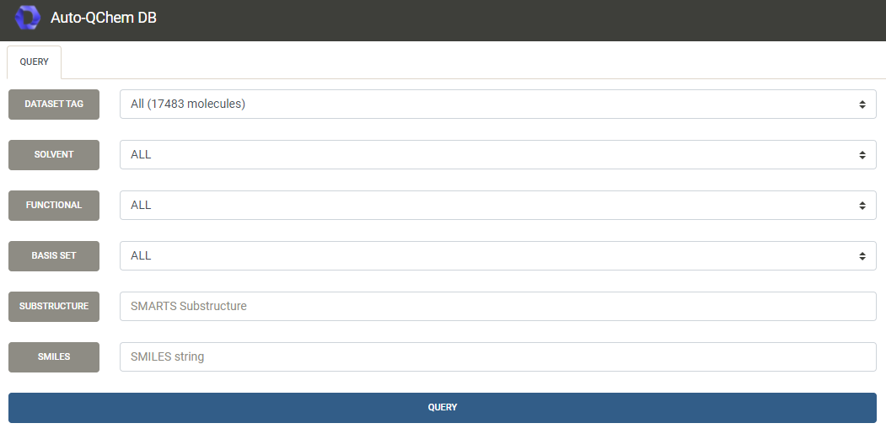
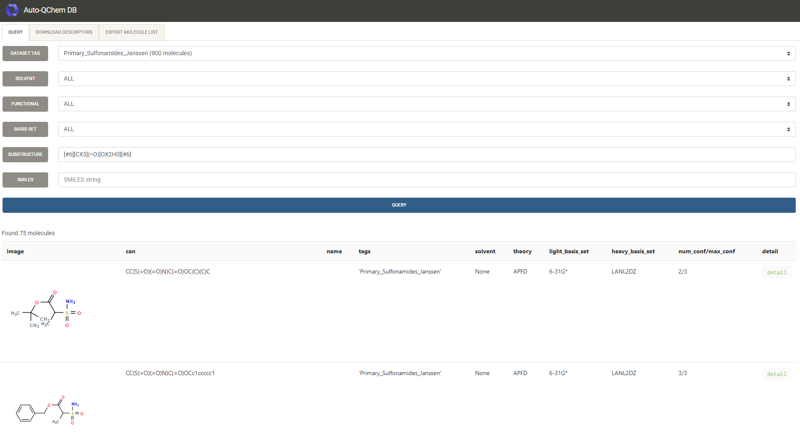
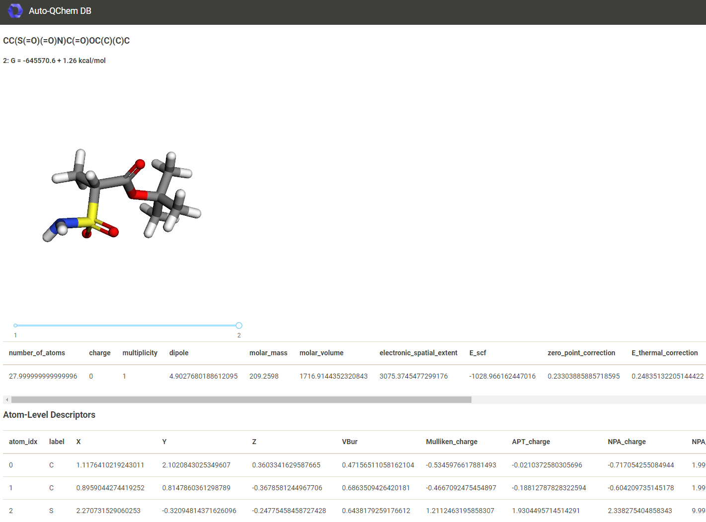
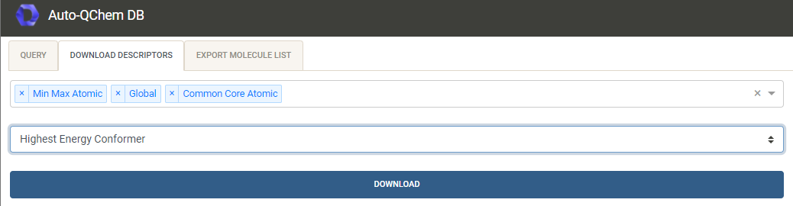

# Auto-QChem Database User Guide

Auto-QChem stores molecular descriptors in a MongoDB type database. A small web-based user-interface has been
 created to facilitate extractions of descriptors from the database into ```.xlsx``` files for further analysis.

### 1. Query available molecules

Navigate to the [autoqchem.org](https://autoqchem.org)



#### 1.1 Query Form

##### a) Fields
Query form has 2 fields, both are optional:
* __Select tags (multiple choice)__ - each molecule in the DB has an associated tag (or a list of tags), they
are used to mark specific collections of molecules. If you select multiple tags, molecules 
for all tags will be displayed. If left blank
all molecules in the DB will be queried
* __SMARTS substructure__ - queries the molecules for a substructre using the SMARTS query (SMILES strings
are a subset of SMARTS), quick reference to the SMARTS query language can be looked up 
here [https://www.daylight.com/dayhtml_tutorials/languages/smarts/index.html](https://www.daylight.com/dayhtml_tutorials/languages/smarts/index.html) 

##### b) Buttons
There are two buttons ```Query``` and ```Export```.
 * __Query__ - queries the DB and displays the table of queried molecules
 * __Export__ - downloads the displayed table as an ```.xlsx``` file, shall be used after hitting ```Query``` 

 
 Result of an example query on a single tag with 1166 molecules, and with SMARTS query for anhydrides:
 
 
 
 #### 1.2 Descriptors Lookup
 
 For each entry in the table a link to a descriptors lookup called is available in the rightmost 
 column. It will display the the QChem descriptors for the given molecule. If the molecule contains multiple
 conformations, the "Boltzmann" average of all descriptors is shown.
 
 
 
 ### 2. Descriptors extraction
 
 Once molecules have been queried, their descriptors can be extracted into an ```.xlsx``` file by toggling the
 ```Download descriptors``` bar and filling the form.
 
 
 
 #### 2.1 Download Form

##### a) Fields
All fields are required

* __Descriptor Presets (multiple choice)__ - the following presets are available, choose as many as needed:
    * __Global__ - molecule level descriptors, e.g. homo energy, dipole moment, molecular weight, etc.
    * __Min Max Atomic__ - atomic level descriptors minimum and maximum over the atoms within the molecule, e.g. 
    buried volume, Mulliken charge, NMR shift, etc.
    * __Substructure Core__ - atomic level descriptors for the common core of atoms within the dataset, the common
    core is determined using the [MCS procedure](https://www.rdkit.org/docs/source/rdkit.Chem.MCS.html) from rdkit.
    If substructure has been used for filtering, the common core will include the substructure and potentially
    more atoms.
    * __Substructure Labeled__ - atomic level descriptors for labeled molecules. The labels must be consistent, i.e.
    each molecule must have exactly the same labels, for example 1,2,3,4, the labelled elements can
    be different, only the numbering scheme shall be consistent.
    * __Transitions__ - top 10 excited state transitions ordered by their oscillation strength
* __Conformer option (single choice)__ - choose one of the following options:
    * __Boltzmann__ - Boltzmann average
    * __Max__ - lowest energy conformer (maximum weight conformer)
    * __Min__ - highest energy conformer (minimum weight conformer)
    * __Mean__ - arithmetic average
    * __Std__ - standard deviation over the conformers
    * __Any__ - randomily chosen conformer

##### b) Buttons
    
* __Download__ - download the descriptors to an ```.xlsx``` file. Note: when extracting descriptors for hundreds of
 molecules this operation can take up to few minutes, depending on the server load.
     
