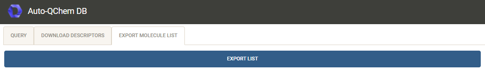

# Auto-QChem Database User Guide

Auto-QChem stores molecular descriptors in a MongoDB type database. A small web-based user-interface has been created to
facilitate extractions of descriptors from the database into ```.xlsx``` files for further analysis.

### 1. Query available molecules

Navigate to the [autoqchem.org](https://autoqchem.org)


#### 1.1 Query TAB

##### Fields

Query form has 6 fields, first 4 are required, last 2 are optional:

* __Dataset tag__ - select dataset filter, use 'ALL' for a whole DB query. Each molecule in the DB has an associated
  datasets tag
  (or a list of tags), they are used to mark specific collections of molecules dedicated to specific analyses
* __Solvent__ - solvent filter, use 'ALL' to ignore filter
* __Functional__ - functional filter, use 'ALL' to ignore filter
* __Basis Set__ - basis set filter, use 'ALL' to ignore filter
* __SMARTS substructure__ - filters the molecules for substructre using the SMARTS query. A quick reference to the
  SMARTS query language can be looked up
  here [https://www.daylight.com/dayhtml_tutorials/languages/smarts/index.html](https://www.daylight.com/dayhtml_tutorials/languages/smarts/index.html)
* __SMILES__ - smiles filter. This can be used for searches for a specific molecule. Canonicalization is not required.

Upon successful query additional 2 tabs will appear, "Download Descriptors" and "Export Molecule List"

#### 1.2 Download Descriptor TAB


Download form has 2 fields, both are required:

* __Descriptor Presets (multiple choice)__ - the following presets are available, choose as many as needed:
    * __Global__ - molecule level descriptors, e.g. homo energy, dipole moment, molecular weight, etc.
    * __Min Max Atomic__ - atomic level descriptors minimum and maximum over the atoms within the molecule, e.g. buried
      volume, Mulliken charge, NMR shift, etc.
    * __Substructure Atomic__  - only relevant if substructure was used for the query. The atoms matching the
      substructure are extracted in consistent order and their descriptors are obtained
    * __Common Core__ - atomic level descriptors for the common core of atoms within the dataset, the common core is
      determined using the [MCS procedure](https://www.rdkit.org/docs/source/rdkit.Chem.MCS.html) from rdkit. If
      substructure has been used for filtering, the common core will include the substructure and potentially more
      atoms.
    * __Labeled Atomic__ - atomic level descriptors for labeled molecules. The labels must be consistent, i.e. each
      molecule must have exactly the same labels, for example 1,2,3,4, the labelled elements can be different, only the
      numbering scheme shall be consistent.
    * __Transitions__ - top 10 excited state transitions ordered by their oscillation strength
* __Conformer option (single choice)__ - choose one of the following options:
    * __Boltzmann__ - Boltzmann average
    * __Max__ - lowest energy conformer (maximum weight conformer)
    * __Min__ - highest energy conformer (minimum weight conformer)
    * __Mean__ - arithmetic average
    * __Std__ - standard deviation over the conformers
    * __Any__ - randomily chosen conformer The result of the query is downloaded into an ```.xlsx``` sheet.

#### 1.3 Export Molecules List TAB



Export button downloads the queried list of molecules into an ```.xlsx``` sheet.

Result of an example query on a specific tag containing primary sulfonamides, and with SMARTS query for anhydrides,
resulting in 75 matches.


### 2 Descriptors Lookup

For each entry in the table a link to a descriptors lookup is available in the rightmost column. It displays an
interactive 3D visualization of the molecule conformers as well as the descriptors of the molecule. If the molecule
contains multiple conformations, the descriptors are Boltzman averages over the conformer ensemble.


 
     
